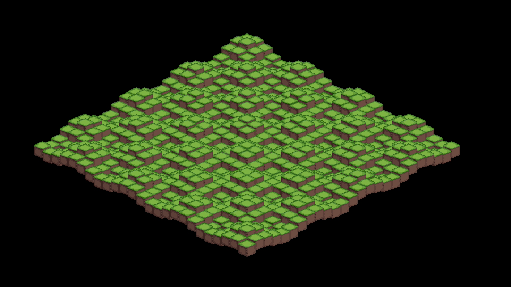

# Isometric Tiles
## Try the project for yourself [here](https://fecty.github.io/assets/isometric/isometric_tiles.html).




Isometric Tiles is a project built using [raylib](raylib/README.md), a simple and easy-to-use library to enjoy videogames programming. This project demonstrates rendering and managing isometric tilemaps, which are commonly used in 2D games to create a pseudo-3D effect. Watch video demonstration [here](https://www.youtube.com/watch?v=dv4SaadRs4c).

## Features

- Isometric tilemap rendering
- Example code for tile placement and manipulation
- Uses raylib for graphics, input, and window management
- Easily extensible for game prototypes or educational purposes
### Controls
```
 ( O / L )          # to control grid size
 ( I / K )          # to control oscillation speed
 ( U / J )          # to control amplitude
 ( Y / H )          # to control standard deviation
 ( 1, 2, ..., 9 )   # to choose among different oscillation patterns
 ( SPACE )          # to reset to default
```

## Project Structure

```
assets/           # Game assets (tilesets, images, etc.)
bin/              # Compiled binaries
include/          # Header files (raylib, raymath, rlgl)
lib/              # Libraries
raylib/           # raylib source and build files
src/              # Project source code (main.cpp, definitions.hpp)
.gitignore        # To specify which files to ignore by git
LICENSE           # Project's MIT license
Makefile          # To build the project
README.md         # File containing details towards the project
```

## Getting Started

1. **Clone the repository** and initialize submodules if needed.
2. **Build raylib** using the provided build scripts or Makefile in the `raylib/` directory. (Note: This step can be skipped for Linux machines, as the project already contains raylib linux binaries)
3. **Build this project**:

   ```sh
   cd src
   make
   ```

4. **Run the executable** from the `bin/` directory.

## Dependencies

- [raylib](https://www.raylib.com/)
- C/C++ compiler (GCC, Clang, MSVC, etc.)

## License

This project is licensed under the MIT License. See LICENSE for details.

## Credits

- Built with [raylib](https://github.com/raysan5/raylib) by Ramon Santamaria and contributors.
